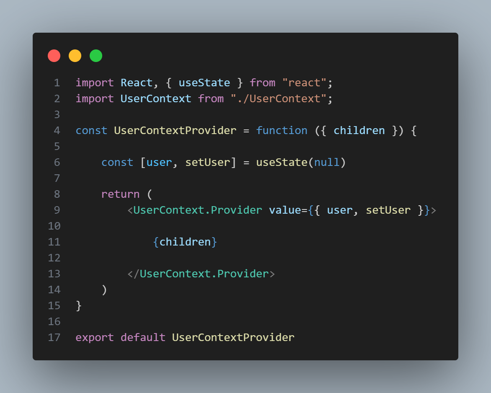
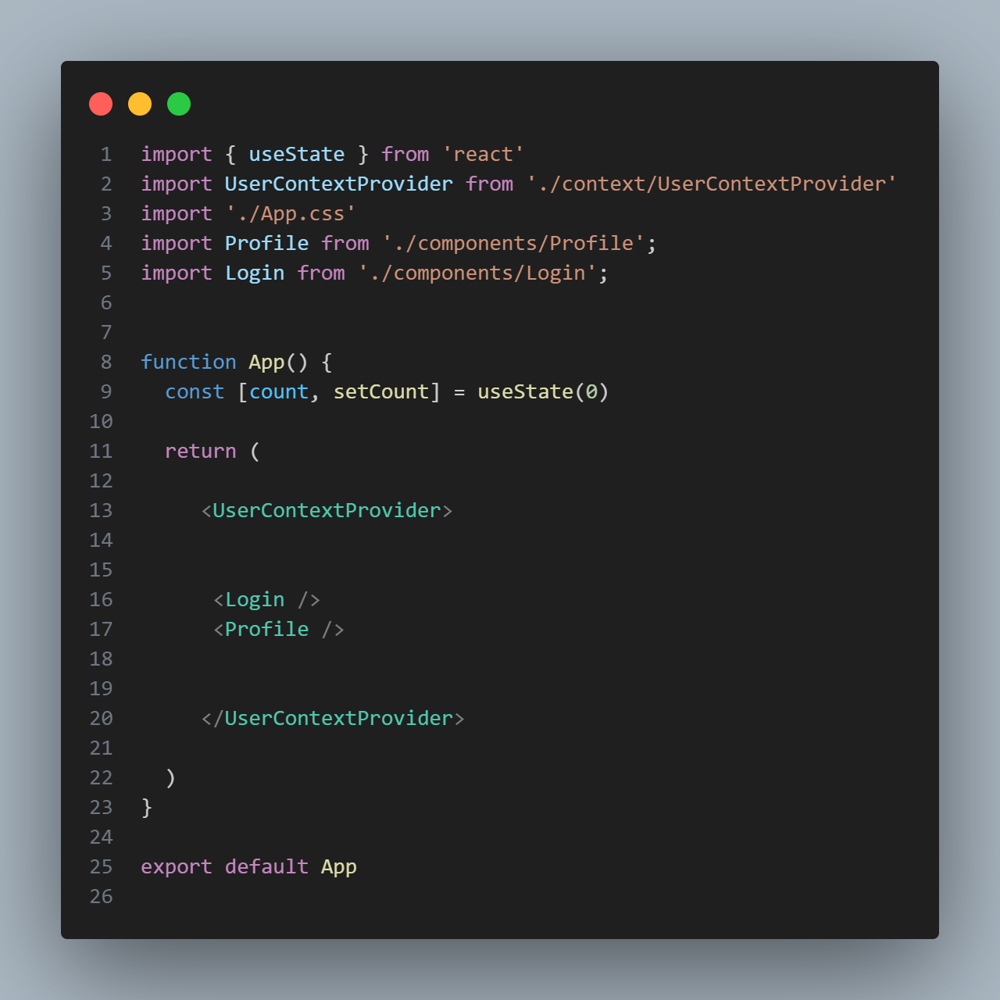
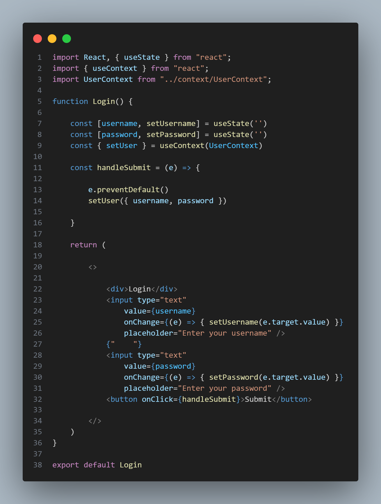
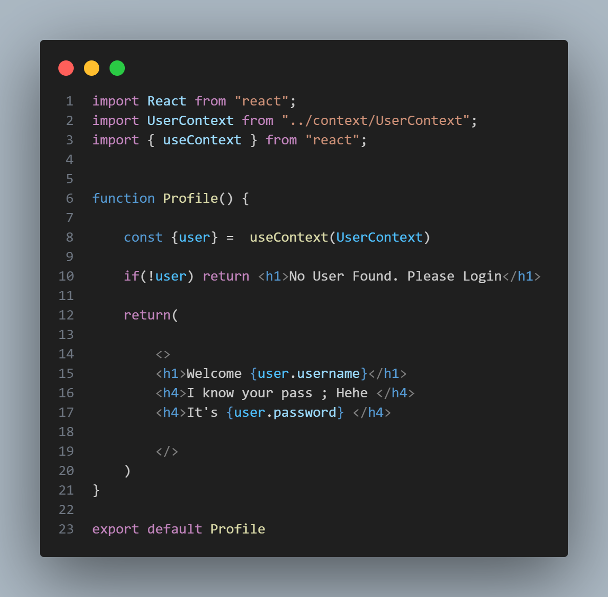

# React Context Api
##### Basically when we need to pass the data from top to very bottom we normally use props , but in that case we pass the data to that components which actually does not needs that data , so we use context api , we store the data in globally and access it from anywhere

Lets see how to use this step by step : 

### Step-1 : 
First create react project by using this command :

 <pre>npm install vite@latest </pre>

### Step-2 :

Create a context folder in the src file 
then create a context and provider 

Context file --- > UserContext.js

Provider file ---> UserContextProvider.jsx

### Step-3 :

##### UserContext.js File

 <pre>import React from "react";

const UserContext = React.createContext()

export default UserContext;</pre>

### Step-4 :

##### UserContextProvider.jsx

under the value , write all the value you want to pass like user,setUser

### Step-5 :
#### Main Question is how to access the passed value ?  Ans in very simple , All you need to do is wrap the text into "UserContextProvider" 

### Let's Create two example file to clear the concept
### Login --> Send Data
### Profile --> Access Data

##### Login.jsx

##### Profile.jsx

### Thank you , If you like this give a star !